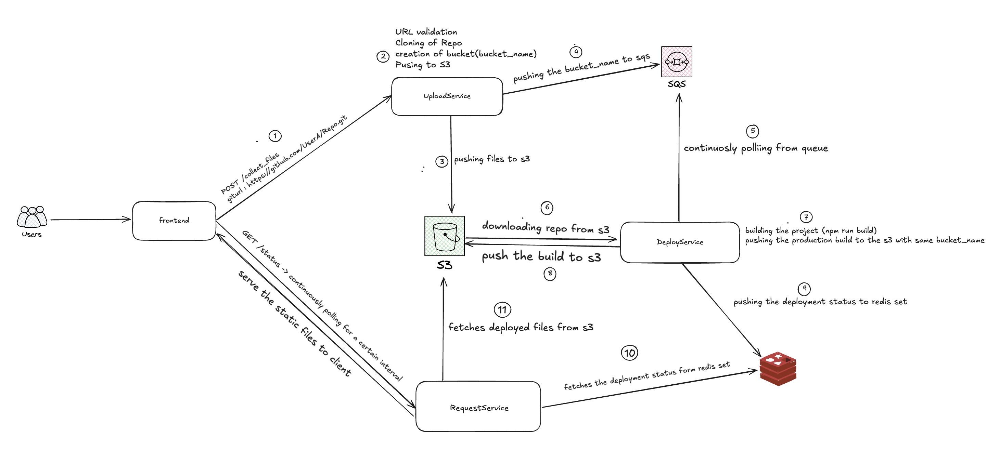

# AutoDeployer

AutoDeployer is a tool designed to automate the deployment process of your Client side applications. This README will guide you through the environment setup, adding credentials, and explaining the services provided by AutoDeployer.

<p align="center">
  
</p>

## Setup Instructions

1. **Clone the Repository**
    ```bash
    git clone https://github.com/Krishna1922/AutoDeployer.git
    cd AutoDeployer
    ```
#### Open 4 terminals for all the services.

2. **Install Dependencies and start the frontend**
    ```bash
    cd vercel-demo
    npm install
    npm start
    ```

3. **Set up Environment and run the Deploy service**
    
    Create a `.env` file in the root directory and add the following variables:

    ```plaintext
    AWS_REGION=
    AWS_ACCESS_KEY=
    AWS_SECRET=
    AWS_SQS_URL=
    ```

    Run the following commands
    
    Remember to run **Redis** locally
    ```bash
    cd DeployService
    python3 -m venv env
    source /env/bin/activate

    python3 queuePolling.py
    ```
4. **Set up Environment and run the Request service**

    Create a `.env` file in the root directory and add the following variables:

    ```plaintext
    AWS_REGION=
    AWS_ACCESS_KEY=
    AWS_SECRET=
    AWS_SQS_URL=
    ```

    Run the following commands
    
    Remember to run **Redis** locally
    ```bash
    cd RequestService
    python3 -m venv env
    source /env/bin/activate

    uvicorn main:app --reload
    ```
5. **Set up Environment and run the Upload service**

    Create a `.env` file in the root directory and add the following variables:

    ```plaintext
    AWS_REGION=
    AWS_ACCESS_KEY=
    AWS_SECRET=
    AWS_SQS_URL=
    ```

    Run the following commands
    
    Remember to run **Redis** locally
    ```bash
    cd UploadService
    python3 -m venv env
    source /env/bin/activate

    uvicorn main:app --reload
    ```
6. **Accessing the Appilication**

- Ones everything is running try to access the app at ```http://localhost:3000```.
- paste the github repo url hit Upload and wait for few minutes you will get your deployed URL.
- Now bind the recieved url with your local computer host
- Run command ```sudo vim /etc/hosts/``` and add new entry ```127.0.0.1 your_url```
- save and access the deployed application.


    
## Techstack

- python3
- FastAPI
- AWS (SQS, AWS)
- Docker
- Redis
